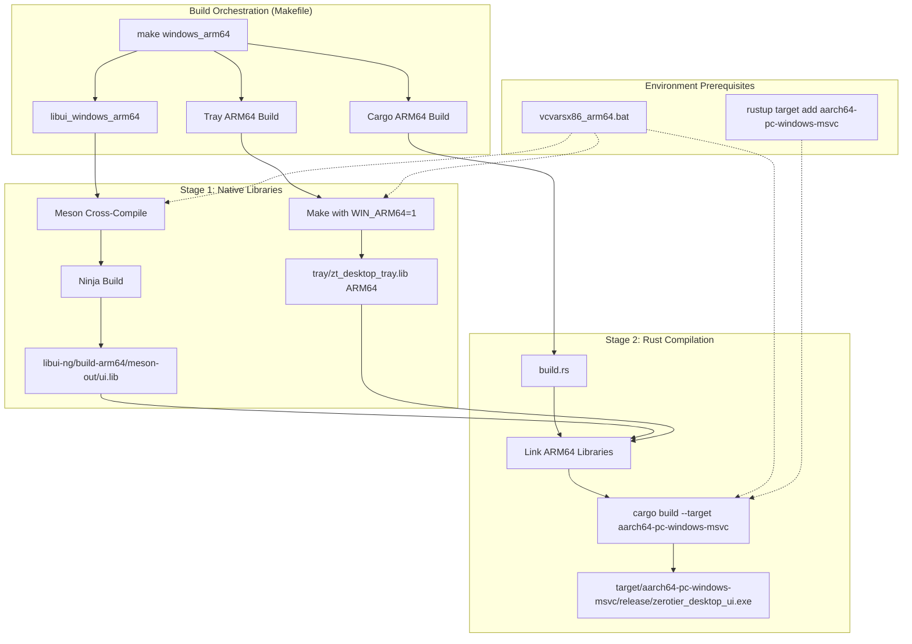
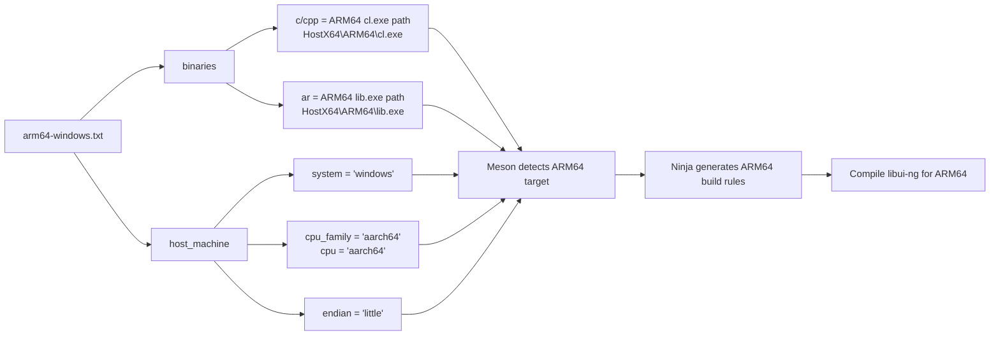

# Technical Design: Windows ARM64 Build Support

## Overview

This feature extends the ZeroTier Desktop UI build system to support Windows ARM64 (aarch64) architecture, enabling native execution on Snapdragon-powered Windows devices and future ARM-based Windows hardware. The implementation follows the established build patterns for Windows x86 and x64 targets, leveraging Rust's cross-compilation capabilities with the `aarch64-pc-windows-msvc` target.

**Users**: Developers building ZeroTier Desktop UI will gain the ability to produce ARM64 Windows binaries using the same Makefile-based workflow as existing targets. End users running Windows 11 on ARM64 devices will benefit from native performance instead of x64 emulation.

**Impact**: This enhancement modifies the existing multi-stage build orchestration (Makefile → Meson/Ninja → Cargo) by adding a third Windows architecture target alongside x86 and x64. The core application code remains unchanged; all modifications are confined to build configuration files (`Makefile`, `build.rs`, Meson cross file) and build infrastructure.

### Goals

- Enable cross-compilation from x64 Windows hosts to ARM64 Windows targets without requiring ARM64 hardware
- Maintain consistency with existing Windows build patterns (vcvars environment, static CRT linking, Meson/Ninja workflow)
- Produce standalone ARM64 executable at `target\aarch64-pc-windows-msvc\release\zerotier_desktop_ui.exe`
- Integrate ARM64 target into `make windows` to build all three architectures (x86, x64, ARM64)
- Provide binary validation mechanism for developers without ARM64 hardware

### Non-Goals

- Native ARM64 runtime testing automation (requires ARM64 hardware or VM)
- Universal/fat binaries combining multiple architectures (Windows doesn't support this unlike macOS `lipo`)
- Windows 10 ARM64 backward compatibility (focus on Windows 11 ARM64 with Visual Studio 2022)
- Automatic CI/CD ARM64 builds (GitHub Actions/Azure Pipelines lack native ARM64 Windows runners)

## Architecture

### Existing Architecture Analysis

The current build system follows a multi-stage pattern established for cross-platform native desktop applications:

**Stage 1: Native Libraries (C/C++)**
- `libui-ng`: UI toolkit compiled via Meson/Ninja with MSVC
- `tray`: System tray library compiled via Make with GCC (Linux/macOS) or MSVC (Windows)

**Stage 2: Rust Compilation**
- Links against stage 1 static libraries via `build.rs`
- Uses MSVC linker for Windows targets
- Applies architecture-specific RUSTFLAGS

**Existing Patterns to Preserve**:
- vcvars batch file execution before compilation (sets environment for MSVC toolchain)
- Meson flags: `--buildtype=release -Db_vscrt=mt --default-library=static`
- RUSTFLAGS: `-C target-feature=+crt-static` for static CRT linking
- Separate build directories per architecture to prevent conflicts

**Architectural Constraints**:
- Windows ARM64 requires MSVC toolchain (no GNU/MinGW support)
- Native libraries must match Rust binary architecture exactly (no mixed x64/ARM64 linking)
- vcvars environment must be active for both Meson and Cargo compilation

### High-Level Architecture



### Technology Alignment

**No New Technologies**: This feature uses the existing technology stack without additions.

**Alignment with Existing Stack**:
- **Rust**: Existing `aarch64-pc-windows-msvc` target (official tier-2 support)
- **MSVC**: Visual Studio 2022 ARM64 build tools (same toolchain as x64/x86)
- **Meson/Ninja**: Cross-compilation via cross file (same workflow as x64/x86)
- **Make**: GNU Make orchestration (consistent with all platforms)

**New Dependencies Introduced**:
- Visual Studio 2022 component: "ARM64/ARM64EC build tools (Latest)"
- Windows 11 SDK (already required for Windows builds)
- Meson cross file: `arm64-windows.txt` (new configuration file)

**Pattern Adherence**:
- Follows existing Windows build pattern (vcvars → Meson → Cargo)
- Replicates `windows_64` target structure for `windows_arm64`
- Maintains separate build directories per architecture (`build-arm64`)

### Key Design Decisions

#### Decision 1: Cross-Compilation vs. Native ARM64 Builds

**Context**: ARM64 binaries can be built either natively on ARM64 Windows hardware or cross-compiled from x64 Windows hosts.

**Alternatives**:
1. **Native ARM64 builds only**: Require developers to have ARM64 Windows devices
2. **Cross-compilation from x64**: Use x64 host with ARM64 cross-compiler
3. **Cloud-based ARM64 builds**: Use CI/CD with ARM64 runners

**Selected Approach**: Cross-compilation from x64 Windows hosts using `vcvarsx86_arm64.bat`

**Rationale**:
- Most developers have x64 Windows machines; ARM64 Windows devices are less common
- Rust and MSVC fully support x64→ARM64 cross-compilation without emulation overhead
- Consistent with macOS approach (x64 host builds universal binaries including ARM64)
- No dependency on cloud infrastructure or CI/CD availability

**Trade-offs**:
- **Gain**: Builds work on existing developer machines; no new hardware requirement
- **Sacrifice**: Cannot runtime-test ARM64 binary on build machine; requires separate validation strategy (binary inspection or manual testing on ARM64 device)

#### Decision 2: Meson Cross File vs. Environment-Only Compilation

**Context**: Meson can detect compilers from environment variables (vcvars) or use explicit cross files specifying compiler paths.

**Alternatives**:
1. **Explicit cross file** with hardcoded MSVC ARM64 compiler paths
2. **Environment detection** relying on vcvars to set compiler environment
3. **Hybrid** using cross file with environment variable references

**Selected Approach**: Explicit Meson cross file with documented MSVC version updates

**Rationale**:
- Provides deterministic builds independent of environment quirks
- Makes architecture selection explicit (prevents accidental x64 builds)
- Aligns with research findings recommending explicit cross files for reliability
- Easier to debug when compiler paths are visible in configuration

**Trade-offs**:
- **Gain**: Reliable, reproducible builds; clear configuration; matches industry best practices
- **Sacrifice**: Requires updating cross file when Visual Studio MSVC version changes (e.g., 14.44.35207 → 14.45.x); mitigated by documentation and comments in cross file

#### Decision 3: Shared vs. Separate Makefile Targets for Windows

**Context**: The Windows build currently has `windows: windows_32 windows_64`. ARM64 could be integrated or kept separate.

**Alternatives**:
1. **Separate target**: `make windows_arm64` (independent from `make windows`)
2. **Integrated**: `make windows` builds x86, x64, and ARM64 automatically
3. **Optional flag**: `make windows ARM64=1` to opt-in to ARM64 build

**Selected Approach**: Separate `windows_arm64` target; update `windows` to include all three

**Rationale**:
- Developers can build ARM64 independently for faster iteration
- `make windows` becomes comprehensive Windows build (all architectures)
- Consistent with macOS approach (separate targets, combined in top-level)
- Backward compatible: existing `make windows` behavior extended, not replaced

**Trade-offs**:
- **Gain**: Flexibility for incremental builds; backward compatibility; clear opt-in for ARM64
- **Sacrifice**: `make windows` takes longer (builds three targets instead of two); mitigated by developers using `windows_arm64` directly when needed

## System Flows

### Build Process Flow

```mermaid
graph TB
    Start([Developer: make windows_arm64])
    Start --> CheckPrereq{Prerequisites Met?}

    CheckPrereq -->|No| ErrorMsg[Error: Install VS 2022 ARM64 tools<br/>and rustup target]
    CheckPrereq -->|Yes| VCVarsSetup[Execute vcvarsx86_arm64.bat]

    VCVarsSetup --> BuildLibUI[Build libui-ng ARM64]

    subgraph "libui-ng Compilation"
        BuildLibUI --> CleanLibUI[rmdir libui-ng/build-arm64]
        CleanLibUI --> MesonSetup[meson setup build-arm64<br/>--cross-file=arm64-windows.txt<br/>--buildtype=release -Db_vscrt=mt]
        MesonSetup --> NinjaBuild[ninja -C build-arm64 -j 12]
        NinjaBuild --> RenameLib[rename libui.a → ui.lib]
    end

    RenameLib --> BuildTray[Build tray ARM64]

    subgraph "Tray Compilation"
        BuildTray --> CleanTray[make -C tray clean]
        CleanTray --> TrayMake[make -C tray zt_lib WIN_ARM64=1]
        TrayMake --> TrayOutput[tray/zt_desktop_tray.lib ARM64]
    end

    TrayOutput --> BuildRust[Build Rust ARM64]

    subgraph "Rust Compilation"
        BuildRust --> BuildScript[build.rs executes]
        BuildScript --> SetPaths[Set library search paths:<br/>libui-ng/build-arm64/meson-out<br/>tray/]
        SetPaths --> CargoCompile[cargo build --release<br/>--target aarch64-pc-windows-msvc<br/>RUSTFLAGS=-C target-feature=+crt-static]
        CargoCompile --> OutputBinary[target/aarch64-pc-windows-msvc/release/<br/>zerotier_desktop_ui.exe]
    end

    OutputBinary --> Validate{Validation Requested?}
    Validate -->|Yes| DumpBin[dumpbin /headers | findstr machine]
    DumpBin --> ValidateArch{Shows AA64?}
    ValidateArch -->|Yes| Success([Build Complete])
    ValidateArch -->|No| ArchError[Error: Binary is wrong architecture]
    Validate -->|No| Success

    ErrorMsg --> End([Build Failed])
    ArchError --> End
```

### Meson Cross-Compilation Configuration Flow



## Requirements Traceability

| Requirement | Summary | Components | Interfaces | Flows |
|-------------|---------|------------|------------|-------|
| 1.1-1.5 | Rust ARM64 Toolchain Config | Makefile, build.rs | `rustup target add`, `cargo build --target` | Build Process Flow |
| 2.1-2.5 | VS ARM64 Build Tools | Makefile, vcvars | `vcvarsx86_arm64.bat` execution | Build Process Flow |
| 3.1-3.6 | libui-ng ARM64 Compilation | Makefile, Meson cross file | `meson setup --cross-file`, `ninja -C build-arm64` | Meson Cross-Compilation Flow |
| 4.1-4.5 | Tray ARM64 Compilation | Makefile, tray/Makefile | `make zt_lib WIN_ARM64=1` | Build Process Flow |
| 5.1-5.6 | Makefile ARM64 Targets | Makefile | `windows_arm64`, `libui_windows_arm64` | Build Process Flow |
| 6.1-6.5 | build.rs Arch-Specific Config | build.rs | `cargo:rustc-link-search`, `cfg(target_arch)` | Build Process Flow |
| 7.1-7.4 | Dependency Compatibility | Cargo.toml | Existing crates (no changes) | N/A (verification only) |
| 8.1-8.5 | Build Validation | Makefile, PowerShell | `dumpbin /headers` | Build Process Flow (validation step) |
| 9.1-9.5 | Documentation | README.md | Developer instructions | N/A (documentation) |
| 10.1-10.5 | Meson Cross File | arm64-windows.txt | `[binaries]`, `[host_machine]` | Meson Cross-Compilation Flow |

## Components and Interfaces

### Build Orchestration Layer

#### Makefile

**Responsibility & Boundaries**
- **Primary Responsibility**: Orchestrate multi-stage ARM64 Windows build process (native libraries → Rust binary)
- **Domain Boundary**: Build system configuration; delegates actual compilation to Meson/Ninja, Make (tray), and Cargo
- **Data Ownership**: Build flags (RUSTFLAGS, CARGO_FLAGS), vcvars invocation, target architecture selection

**Dependencies**
- **Inbound**: Developer invocation (`make windows_arm64`), CI/CD scripts
- **Outbound**: Meson/Ninja (libui-ng), Make (tray), Cargo (Rust), vcvars (environment setup)
- **External**: Visual Studio 2022 vcvars scripts, GNU Make, Meson, Ninja, Cargo

**Contract Definition**

**Build Interface (Make Targets)**:

| Target | Purpose | Dependencies | Output |
|--------|---------|--------------|--------|
| `libui_windows_arm64` | Compile libui-ng for ARM64 | vcvars, Meson, Ninja, arm64-windows.txt | `libui-ng/build-arm64/meson-out/ui.lib` |
| `windows_arm64` | Full ARM64 build (libui, tray, Rust) | `libui_windows_arm64`, tray Makefile, Cargo | `target/aarch64-pc-windows-msvc/release/zerotier_desktop_ui.exe` |
| `windows` | Build all Windows architectures | `windows_32`, `windows_64`, `windows_arm64` | Three executables (x86, x64, ARM64) |

**Target Implementation Pattern** (extends existing `windows_64`):

```makefile
libui_windows_arm64: FORCE
    -rmdir /Q /S libui-ng\build-arm64
    cd libui-ng && "C:\Program Files\Microsoft Visual Studio\2022\Community\VC\Auxiliary\Build\vcvarsx86_arm64.bat" && meson setup build-arm64 --cross-file=../arm64-windows.txt --buildtype=release -Db_vscrt=mt --default-library=static --backend=ninja
    cd libui-ng && "C:\Program Files\Microsoft Visual Studio\2022\Community\VC\Auxiliary\Build\vcvarsx86_arm64.bat" && ninja -C build-arm64 -j 12
    cd libui-ng\build-arm64\meson-out && rename libui.a ui.lib

windows_arm64: FORCE
    make libui_windows_arm64
    make -C tray clean
    make -C tray zt_lib WIN_ARM64=1
    set "RUSTFLAGS=-C target-feature=+crt-static" && cargo build $(CARGO_FLAGS) --target=aarch64-pc-windows-msvc
```

**Preconditions**:
- Visual Studio 2022 installed with ARM64 build tools component
- `aarch64-pc-windows-msvc` Rust target installed (`rustup target list` shows `aarch64-pc-windows-msvc (installed)`)
- Meson cross file `arm64-windows.txt` exists in project root

**Postconditions**:
- ARM64 native libraries compiled and placed in architecture-specific directories
- ARM64 Rust binary produced at `target\aarch64-pc-windows-msvc\{debug|release}\zerotier_desktop_ui.exe`
- Exit code 0 on success; non-zero on compilation failure

**Integration Strategy**:
- **Modification Approach**: Extend existing Makefile by adding new targets; pattern replication from `windows_64`
- **Backward Compatibility**: Existing `make windows` behavior preserved; ARM64 added to target list
- **Migration Path**: Immediate availability; no migration needed (additive change)

---

#### build.rs (Cargo Build Script)

**Responsibility & Boundaries**
- **Primary Responsibility**: Configure Rust linker to find architecture-specific native libraries (libui-ng, tray)
- **Domain Boundary**: Rust build configuration; translates architecture selection into correct library paths
- **Data Ownership**: Library search paths, link directives

**Dependencies**
- **Inbound**: Cargo (during Rust compilation), target architecture environment variable
- **Outbound**: MSVC linker (via cargo:rustc-link-search directives)
- **External**: None (pure Rust compile-time code)

**Contract Definition**

**Build Script Interface** (Cargo build script protocol):

```rust
// Architecture detection and path configuration
fn main() {
    let d = env!("CARGO_MANIFEST_DIR");

    // Architecture-specific library paths
    #[cfg(target_arch = "aarch64")]
    {
        println!("cargo:rustc-link-search=native={}/tray", d);
        println!("cargo:rustc-link-search=native={}/libui-ng/build-arm64/meson-out", d);
    }

    #[cfg(target_arch = "x86_64")]
    {
        println!("cargo:rustc-link-search=native={}/tray", d);
        println!("cargo:rustc-link-search=native={}/libui-ng/build/meson-out", d);
    }

    #[cfg(target_arch = "x86")]
    {
        println!("cargo:rustc-link-search=native={}/tray", d);
        println!("cargo:rustc-link-search=native={}/libui-ng/build/meson-out", d);
    }

    // Common link directives (all architectures)
    println!("cargo:rustc-link-lib=static=zt_desktop_tray");
    println!("cargo:rustc-link-lib=static=ui");

    // Linux-specific dynamic libraries (unchanged)
    #[cfg(target_os = "linux")] {
        println!("cargo:rustc-link-lib=dylib=gtk-3");
        println!("cargo:rustc-link-lib=dylib=gdk-3");
        println!("cargo:rustc-link-lib=dylib=gobject-2.0");
        println!("cargo:rustc-link-lib=dylib=glib-2.0");
        println!("cargo:rustc-link-lib=dylib=ayatana-appindicator3");
    }
}
```

**Preconditions**:
- Target architecture set via `--target` flag (e.g., `--target=aarch64-pc-windows-msvc`)
- Native libraries built and present in architecture-specific directories

**Postconditions**:
- Correct library search paths emitted for target architecture
- Linker finds ARM64 libraries when building ARM64 binary (no x64/ARM64 mixing)

**Integration Strategy**:
- **Modification Approach**: Extend existing `build.rs` with `cfg(target_arch = "aarch64")` block
- **Backward Compatibility**: x86 and x64 paths unchanged; ARM64 additive
- **Migration Path**: Immediate; conditional compilation ensures no impact on existing builds

---

### Native Library Build Layer

#### Meson Cross File (arm64-windows.txt)

**Responsibility & Boundaries**
- **Primary Responsibility**: Configure Meson to cross-compile libui-ng from x64 host to ARM64 target
- **Domain Boundary**: Meson build system configuration; specifies compiler paths and target machine
- **Data Ownership**: MSVC ARM64 compiler paths, target architecture metadata

**Dependencies**
- **Inbound**: Meson setup command (`meson setup --cross-file=arm64-windows.txt`)
- **Outbound**: MSVC ARM64 compilers (cl.exe, lib.exe)
- **External**: Visual Studio 2022 installation (compiler paths reference VS install location)

**Contract Definition**

**Cross File Format** (Meson cross-compilation specification):

```ini
[binaries]
c = ['C:\Program Files\Microsoft Visual Studio\2022\Community\VC\Tools\MSVC\14.44.35207\bin\HostX64\ARM64\cl.exe']
cpp = ['C:\Program Files\Microsoft Visual Studio\2022\Community\VC\Tools\MSVC\14.44.35207\bin\HostX64\ARM64\cl.exe']
ar = ['C:\Program Files\Microsoft Visual Studio\2022\Community\VC\Tools\MSVC\14.44.35207\bin\HostX64\ARM64\lib.exe']

[host_machine]
system = 'windows'
cpu_family = 'aarch64'
cpu = 'aarch64'
endian = 'little'

# Note: Update MSVC version (14.44.35207) when Visual Studio updates.
# Find current version: dir "C:\Program Files\Microsoft Visual Studio\2022\Community\VC\Tools\MSVC\"
```

**Preconditions**:
- Visual Studio 2022 installed with ARM64 build tools
- MSVC version in paths matches installed version
- vcvars environment active (sets include paths, lib paths)

**Postconditions**:
- Meson detects ARM64 as target architecture
- Ninja generates ARM64 build rules using specified ARM64 compilers
- Compiled libraries are ARM64 architecture (verifiable with `dumpbin /headers`)

**Invariants**:
- `cpu_family` and `cpu` must always be `aarch64` for ARM64 builds
- Compiler paths must point to `HostX64\ARM64` (cross-compile) not `HostARM64\ARM64` (native)

**Integration Strategy**:
- **Modification Approach**: New file creation; no modification to existing x64/x86 Meson workflow
- **Backward Compatibility**: N/A (new file)
- **Migration Path**: File referenced by Makefile `--cross-file` flag; standalone configuration

---

#### Tray Makefile Extension

**Responsibility & Boundaries**
- **Primary Responsibility**: Compile tray C library for ARM64 architecture using MSVC
- **Domain Boundary**: Tray library build configuration; architecture-specific compiler flags
- **Data Ownership**: `WIN_ARM64` flag, ARM64-specific CFLAGS

**Dependencies**
- **Inbound**: Parent Makefile invocation (`make -C tray zt_lib WIN_ARM64=1`)
- **Outbound**: MSVC ARM64 C compiler (from vcvars environment)
- **External**: vcvars environment (must be active)

**Contract Definition**

**Makefile Extension Pattern** (extends existing `WIN_32BIT` pattern):

```makefile
# Add to existing tray/Makefile Windows section
ifeq ($(WIN_ARM64),1)
    TRAY_CFLAGS := $(OPT_FLAGS) -DTRAY_WINAPI=1 -std=c99 -fno-exceptions -static
    # Note: No -m32/-m64 flag; vcvarsarm64 sets target architecture
else ifeq ($(WIN_32BIT),1)
    TRAY_CFLAGS := $(OPT_FLAGS) -DTRAY_WINAPI=1 -std=c99 -m32 -fno-exceptions -static
else
    TRAY_CFLAGS := $(OPT_FLAGS) -DTRAY_WINAPI=1 -std=c99 -m64 -fno-exceptions -static
endif
```

**Preconditions**:
- vcvarsx86_arm64.bat environment active (sets ARM64 compiler as default)
- `WIN_ARM64=1` flag passed to Make

**Postconditions**:
- `zt_desktop_tray.lib` compiled for ARM64 architecture
- Library placed in `tray/` directory (Rust build script expects it there)

**Integration Strategy**:
- **Modification Approach**: Extend existing tray Makefile with ARM64 conditional block
- **Backward Compatibility**: x86 and x64 builds unchanged (different flags)
- **Migration Path**: Flag-based selection; no migration needed

---

## Error Handling

### Error Strategy

The build system employs fail-fast error handling with clear, actionable error messages guiding developers to resolution. All errors are terminal (non-recoverable) and require developer intervention before retrying.

### Error Categories and Responses

#### Prerequisites Missing (Build Environment Errors)

**Rust Target Not Installed**:
- **Detection**: `rustup target list` doesn't show `aarch64-pc-windows-msvc (installed)`
- **Error Message**: `Error: Rust target 'aarch64-pc-windows-msvc' not installed. Run: rustup target add aarch64-pc-windows-msvc`
- **Recovery**: Developer installs target; retry build
- **Implementation**: Check in Makefile before invoking Cargo (optional validation step)

**Visual Studio ARM64 Tools Missing**:
- **Detection**: vcvarsx86_arm64.bat execution fails or MSVC ARM64 compiler not found
- **Error Message**: `Error: Visual Studio 2022 ARM64 build tools not found. Install 'VS 2022 C++ ARM64/ARM64EC build tools (Latest)' via Visual Studio Installer.`
- **Recovery**: Developer installs VS component; retry build
- **Implementation**: vcvars failure propagates; Meson reports compiler not found

**Meson Cross File Missing**:
- **Detection**: `meson setup --cross-file=arm64-windows.txt` fails with "cross file not found"
- **Error Message**: `Error: Meson cross file 'arm64-windows.txt' not found. Ensure file exists in project root.`
- **Recovery**: Developer creates cross file from template; retry build
- **Implementation**: Meson error propagates to Makefile

#### Compilation Failures (Build Errors)

**Library Machine Type Conflicts**:
- **Symptom**: Linker error: `fatal error LNK1112: module machine type 'x64' conflicts with target machine type 'arm64'`
- **Root Cause**: Mixing x64 and ARM64 libraries during linking
- **Error Message**: `Error: Library architecture mismatch. Rebuild native libraries for ARM64 with: make libui_windows_arm64`
- **Recovery**: Clean and rebuild native libraries for ARM64; retry Rust build
- **Implementation**: Linker error from Cargo; developer must interpret message

**MSVC Compiler Not Found**:
- **Symptom**: Meson error: `C compiler not found`
- **Root Cause**: vcvars environment not active or incorrect compiler path in cross file
- **Error Message**: `Error: ARM64 C compiler not found. Ensure vcvarsx86_arm64.bat is executed before Meson.`
- **Recovery**: Run build from Developer Command Prompt or fix cross file paths
- **Implementation**: Meson error propagates; Makefile documentation clarifies vcvars requirement

**Dependency Build Failures**:
- **Symptom**: Ninja error during libui-ng compilation
- **Root Cause**: Missing Windows SDK, incompatible library versions, or source code issues
- **Error Message**: (Ninja provides detailed error with file/line)
- **Recovery**: Verify Windows 11 SDK installed; check libui-ng source compatibility
- **Implementation**: Ninja error propagates; developer investigates build logs

#### Validation Failures (Post-Build Errors)

**Binary Architecture Verification Failed**:
- **Detection**: `dumpbin /headers` shows machine type other than `AA64`
- **Error Message**: `Error: Built binary is not ARM64 architecture (found: {detected_arch}). Check native library architectures.`
- **Recovery**: Rebuild native libraries ensuring ARM64; verify build.rs paths
- **Implementation**: Optional validation step in Makefile; PowerShell script checks dumpbin output

### Monitoring

**Build Logging**:
- Makefile verbose output (`make -d` for debug mode)
- Meson/Ninja compilation logs in `libui-ng/build-arm64/meson-logs/`
- Cargo build output (warnings, linker errors)

**Health Monitoring** (Developer Validation):
- Pre-build check: `rustup target list | findstr aarch64-pc-windows-msvc` (verify target installed)
- Post-build check: `dumpbin /headers target\aarch64-pc-windows-msvc\release\zerotier_desktop_ui.exe | findstr machine` (verify AA64)

## Testing Strategy

### Unit Tests (N/A - Build System Only)

No unit tests required. Build system correctness validated through successful compilation and binary inspection.

### Integration Tests (Build Verification)

1. **Full ARM64 Build Test**
   - **Test**: Run `make windows_arm64` on clean checkout
   - **Expected**: Build completes successfully; binary at `target\aarch64-pc-windows-msvc\release\zerotier_desktop_ui.exe`
   - **Validation**: `dumpbin /headers` shows `machine (AA64)`

2. **Multi-Architecture Build Test**
   - **Test**: Run `make windows` (all three Windows architectures)
   - **Expected**: Three binaries produced (x86, x64, ARM64) without conflicts
   - **Validation**: All three binaries have correct machine type (`8664` for x64, `14C` for x86, `AA64` for ARM64)

3. **Incremental Build Test**
   - **Test**: Modify Rust source; run `make windows_arm64` again
   - **Expected**: Only Rust recompiled; native libraries skipped
   - **Validation**: Build completes faster; binary timestamp updated

4. **Clean Build Test**
   - **Test**: Run `make clean`, then `make windows_arm64`
   - **Expected**: All components rebuilt from scratch
   - **Validation**: Build directories recreated; all artifacts fresh

5. **Cross-File Missing Test**
   - **Test**: Delete `arm64-windows.txt`; run `make windows_arm64`
   - **Expected**: Meson fails with clear error about missing cross file
   - **Validation**: Error message mentions `arm64-windows.txt` explicitly

### End-to-End Tests (Manual Validation)

1. **ARM64 Windows Runtime Test**
   - **Prerequisites**: ARM64 Windows 11 device or VM
   - **Test**: Copy ARM64 binary to device; execute
   - **Expected**: Application launches; tray icon appears; network operations functional
   - **Validation**: No errors in event log; full feature parity with x64 version

2. **Installation Test**
   - **Prerequisites**: ARM64 Windows 11 device
   - **Test**: Install ZeroTier service; install ARM64 UI binary
   - **Expected**: UI connects to service; auth token discovered; networks listed
   - **Validation**: Functional network join/leave operations

3. **Performance Comparison**
   - **Prerequisites**: ARM64 Windows 11 device with x64 emulation
   - **Test**: Run x64 binary (emulated) vs. ARM64 binary (native); compare startup time, CPU usage
   - **Expected**: ARM64 binary performs better (no emulation overhead)
   - **Validation**: Measure time to tray icon appearance; monitor CPU usage during idle

### Performance/Load Tests (N/A - Build System)

Not applicable. Application performance testing is independent of build system; ARM64 binary should match x64 performance characteristics (no regression).

## Security Considerations

**Threat Model**: Build system security focuses on supply chain integrity and preventing malicious code injection during compilation.

**Security Controls**:

1. **Compiler Verification**
   - MSVC compilers from official Visual Studio installation (signed by Microsoft)
   - vcvars scripts verify compiler authenticity via signature checks
   - No third-party compilers or toolchains introduced

2. **Dependency Integrity**
   - Native libraries (libui-ng, tray) built from source (forked repositories under version control)
   - Rust crates verified via Cargo.lock (same dependencies as x64 build)
   - No new external dependencies introduced for ARM64 support

3. **Build Environment Isolation**
   - Separate build directories per architecture prevent cross-contamination
   - Clean targets remove all build artifacts to prevent stale binary mixing
   - vcvars environment scoped to build process (no global system changes)

4. **Binary Verification**
   - `dumpbin /headers` validation confirms correct architecture (prevents accidental x64 distribution as ARM64)
   - Code signing (existing `ZT_OFFICIAL_RELEASE` workflow) applies to ARM64 binaries
   - Authenticode signatures verifiable by end users

**Compliance Requirements**: None specific to ARM64 builds (inherits existing Windows binary signing and distribution requirements).

## Documentation Requirements

### README.md Updates

Add Windows ARM64 section under "Building → Windows":

```markdown
#### Windows ARM64 (aarch64)

**Prerequisites**:
- Visual Studio 2022 with "ARM64/ARM64EC build tools" component
- Windows 11 SDK
- Rust target: `rustup target add aarch64-pc-windows-msvc`

**Build Commands**:
```bash
# Build ARM64 only
make windows_arm64

# Build all Windows architectures (x86, x64, ARM64)
make windows
```

**Output**: `target\aarch64-pc-windows-msvc\release\zerotier_desktop_ui.exe`

**Validation** (without ARM64 hardware):
```cmd
dumpbin /headers target\aarch64-pc-windows-msvc\release\zerotier_desktop_ui.exe | findstr "machine"
REM Expected output: machine (AA64)
```

**Troubleshooting**:
- **Error: linker `link.exe` not found** → Install Visual Studio 2022 ARM64 build tools
- **Error: library machine type conflicts** → Run `make clean`, then `make libui_windows_arm64`
- **Error: vcvars not configured** → Open "x64_arm64 Cross Tools Command Prompt for VS 2022"
```

### Meson Cross File Documentation

Inline comments in `arm64-windows.txt`:

```ini
# Meson Cross-Compilation File for Windows ARM64
#
# Usage: meson setup build-arm64 --cross-file=arm64-windows.txt
#
# IMPORTANT: Update MSVC version (14.44.35207) when Visual Studio updates.
# Find installed version: dir "C:\Program Files\Microsoft Visual Studio\2022\Community\VC\Tools\MSVC\"
#
# Prerequisites:
# - Visual Studio 2022 with ARM64 build tools component installed
# - vcvarsx86_arm64.bat environment active before running Meson
```

### Developer Onboarding Guide

Create `.kiro/knowledge/windows-arm64-build-guide.md`:

```markdown
# Windows ARM64 Build Quick Start

## One-Time Setup

1. **Install Visual Studio 2022 Components**:
   - Open Visual Studio Installer
   - Modify VS 2022 installation
   - Individual Components → Search "ARM64"
   - Check "MSVC v143 - VS 2022 C++ ARM64/ARM64EC build tools (Latest)"
   - Check "Windows 11 SDK (10.0.xxxxx.0)"
   - Install

2. **Install Rust ARM64 Target**:
   ```bash
   rustup target add aarch64-pc-windows-msvc
   rustup target list | findstr aarch64  # Verify installation
   ```

3. **Verify Prerequisites**:
   - Open "x64_arm64 Cross Tools Command Prompt for VS 2022"
   - Run `cl.exe` → Should show ARM64 compiler version
   - Run `meson --version` → Should show Meson installed

## Building

**From x64_arm64 Cross Tools Command Prompt**:
```bash
cd C:\path\to\DesktopUI
make windows_arm64
```

**Build Time**: ~5-10 minutes (first build); ~1 minute (incremental)

## Verification Without ARM64 Hardware

```cmd
dumpbin /headers target\aarch64-pc-windows-msvc\release\zerotier_desktop_ui.exe | findstr "machine"
```
Expected: `machine (AA64)` or `machine (0xAA64)`

## Common Issues

### vcvars not active
**Symptom**: `cl.exe` not found or wrong architecture
**Solution**: Always build from "x64_arm64 Cross Tools Command Prompt"

### Library machine type conflict
**Symptom**: `LNK1112: module machine type 'x64' conflicts with target machine type 'arm64'`
**Solution**:
```bash
make clean
make libui_windows_arm64
make -C tray clean
make -C tray zt_lib WIN_ARM64=1
cargo build --release --target aarch64-pc-windows-msvc
```

### Meson cross file not found
**Symptom**: `ERROR: Cross file 'arm64-windows.txt' not found`
**Solution**: Ensure `arm64-windows.txt` exists in project root (same directory as Makefile)

## Testing on ARM64 Hardware

If you have access to an ARM64 Windows device:

1. Copy binary: `target\aarch64-pc-windows-msvc\release\zerotier_desktop_ui.exe`
2. Install ZeroTier service (ARM64 version required)
3. Run UI binary
4. Verify tray icon appears and network operations work

## Reference

- Research: [.kiro/knowledge/research-rust-arm64-toolchain-001.md](.kiro/knowledge/research-rust-arm64-toolchain-001.md)
- Requirements: [.kiro/specs/windows-arm64-build/requirements.md](.kiro/specs/windows-arm64-build/requirements.md)
- Design: [.kiro/specs/windows-arm64-build/design.md](.kiro/specs/windows-arm64-build/design.md)
```

---

## Summary

This design extends the existing Windows build system to support ARM64 architecture through pattern replication and integration with established workflows. The implementation requires no new technologies, leverages Rust's cross-compilation capabilities, and maintains architectural consistency with existing x86 and x64 builds.

**Critical Files Modified**:
1. `Makefile` - Add `libui_windows_arm64` and `windows_arm64` targets; update `windows` target
2. `build.rs` - Add `cfg(target_arch = "aarch64")` block for ARM64 library paths
3. `tray/Makefile` - Add `WIN_ARM64` conditional for ARM64 compiler flags
4. `README.md` - Document ARM64 build prerequisites and commands

**New Files Created**:
1. `arm64-windows.txt` - Meson cross-compilation configuration for ARM64
2. `.kiro/knowledge/windows-arm64-build-guide.md` - Developer onboarding guide

**Next Phase**: Task generation will break down implementation into discrete, testable steps with validation criteria for each file modification.
